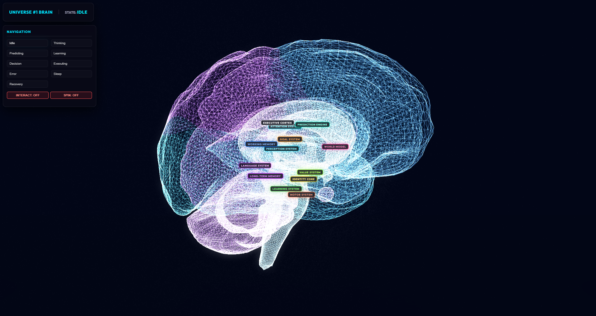

# 🧠 Universe #1 Brain Visualizer

> **"The ultimate high-fidelity 3D visual telemetry console for biological and cognitive intelligence mapping."**

[](https://github.com/virajverse/Universe-No-1-Brain-Ui)
[](https://github.com/virajverse/Universe-No-1-Brain-Ui)
[](https://github.com/virajverse/Universe-No-1-Brain-Ui)
[](https://github.com/virajverse/Universe-No-1-Brain-Ui)

---

## 🗺️ Table of Contents

- [🧠 Universe #1 Brain Visualizer](#-universe-1-brain-visualizer)
  - [🗺️ Table of Contents](#️-table-of-contents)
  - [🚀 Project Overview](#-project-overview)
  - [⚡ Features](#-features)
  - [🎨 Screenshots \& Live Demo](#-screenshots--live-demo)
  - [🛠️ Tech Stack](#️-tech-stack)
  - [📂 Folder Structure](#-folder-structure)
  - [⚙️ Installation Guide](#️-installation-guide)
  - [🕹️ Usage \& Integrations](#️-usage--integrations)
  - [🤝 Contributing Guidelines](#-contributing-guidelines)
  - [📜 License](#-license)
  - [👥 Contact \& Authors](#-contact--authors)

---

## 🚀 Project Overview

The **Universe #1 Brain** visualizer is a WebGL-powered 3D diagnostics console built to render live telemetry from active Python cognitive servers. 

Rather than serving as a static model viewer, this dashboard hooks directly into system-level runtime variables (latency, ticks, cognitive backpressure, CPU load, and RAM usage), rendering dendritic networks, action potentials, and regional highlights in real-time at a locked **60+ FPS**.

---

## ⚡ Features

* 🚀 **Instant-Boot Asynchronous Streaming**: Renders UI components, functional nodes, and central organic veins in `<100ms`. Streams the heavy 3D cortical meshes asynchronously in the background to ensure perfect Lighthouse paint scores.
* 🩸 **Organic 3D Tubular Veins**: Volumetric paths representing complex neural tracts, carrying colored, source-matched micro-signal packets dynamically.
* 🛰️ **WebSocket Telemetry Sync**: Native integration with local/remote Python daemons (`ws://localhost:8080/telemetry`) to capture cognitive states, cycle loops, and queue sizes.
* 🔭 **Interactive Node Selectors**: Hover, click, and lock camera views onto 13 distinct functional lobes (Executive Control, Attention, Predictive Processing, Working Memory, etc.).
* 📊 **Subsystem telemetry HUD**: Live tracking metrics (Frequency in Hz, Latency, Queue Backlog) and visual adapters overlay (e.g. active camera stream parsing matrix).

---

## 🎨 Screenshots & Live Demo

| 🌐 **Live Application** | [Launch Web Demo](https://versebrain.vercel.app/) |
|---|---|



---

## 🛠️ Tech Stack

* **Rendering Engine**: ⚡ `Three.js` (WebGL Core)
* **Animation & Tweens**: ☄️ `GSAP (TweenMax)`
* **Module Bundler**: ⚙️ `Webpack 3` & `Babel`
* **Realtime Protocol**: 📡 `WebSockets`
* **Styling**: 🎨 `Vanilla CSS3` (Glassmorphic Dashboard Design)

---

## 📂 Folder Structure

```markdown
3dbrain/
├── build/                 # Webpack configuration files
├── config/                # Environment configurations
├── dist/                  # Built assets ready for production hosting
├── static/                # Static assets streamed at runtime
│   ├── fonts/             # Local typeface json files
│   ├── models/            # 3D .obj mesh models (BrainUVs.obj)
│   ├── textures/          # Textures & sensory scan templates
│   └── sounds/            # Ambient system audio clips
└── src/                   # Main application code
    ├── css/               # Core design systems & styles
    └── js/                # Application modules
        ├── Loaders/       # Asynchronous Asset Load Managers
        ├── services/      # Telemetry streams & particle handlers
        ├── views/         # Abstract View & Boilerplate engines
        └── MainBrain.js   # Master visualizer orchestration controller
```

---

## ⚙️ Installation Guide

Follow these steps to spin up the local development dashboard:

1. **Clone and Navigate**:
   ```bash
   git clone https://github.com/virajverse/Universe-No-1-Brain-Ui.git
   cd Universe-No-1-Brain-Ui/3dbrain
   ```

2. **Install Dependencies**:
   ```bash
   npm install
   ```

3. **Start Development Server**:
   ```bash
   npm run dev
   ```

4. **Access in Browser**:
   Open **[http://localhost:8081](http://localhost:8081)**.

---

## 🕹️ Usage & Integrations

To feed real telemetry into the dashboard, launch the backend server matching the client websocket expectation (`ws://localhost:8080/telemetry`):

```bash
# Launch python telemetry server in workspace root
python brain_ws_server.py
```

### Supported Cognitive States

The visualizer dynamically transitions styling patterns across the following telemetry states:

| State | Primary Color | Spin Behavior | Subsystem Focus |
|---|---|---|---|
| `IDLE` | 🌌 Deep Purple | OFF (Manual Toggle) | Baseline telemetry |
| `THINKING` | 🧠 Bright Purple | ON (Slow Spin) | High backpressure alerts |
| `PREDICTING`| 🛸 Cyan | ON (Medium Spin) | Sensor stream scanning |
| `LEARNING` | 🧪 Green | OFF | Dendritic weight tweaks |
| `DECISION` | ⚡ Gold / Yellow | ON (Fast Spin) | Executive locks |

---

## 🤝 Contributing Guidelines

Contributions are welcome! Please follow these simple steps:

1. **Fork the Repository** to your GitHub account.
2. **Create a Feature Branch** (`git checkout -b feature/amazing-feature`).
3. **Commit Your Changes** with clear descriptive notes (`git commit -m 'Add awesome volumetric dendrites'`).
4. **Push to the Branch** (`git push origin feature/amazing-feature`).
5. **Open a Pull Request** explaining your enhancements.

---

## 📜 License

Distributed under the **MIT License**. See `LICENSE` for more information.

[](https://opensource.org/licenses/MIT)

---

## 👥 Contact & Authors

* **Project Owner**: VirajVerse Team - [@virajverse](https://github.com/virajverse)
* **Visualizer Link**: [https://github.com/virajverse/Universe-No-1-Brain-Ui](https://github.com/virajverse/Universe-No-1-Brain-Ui)
